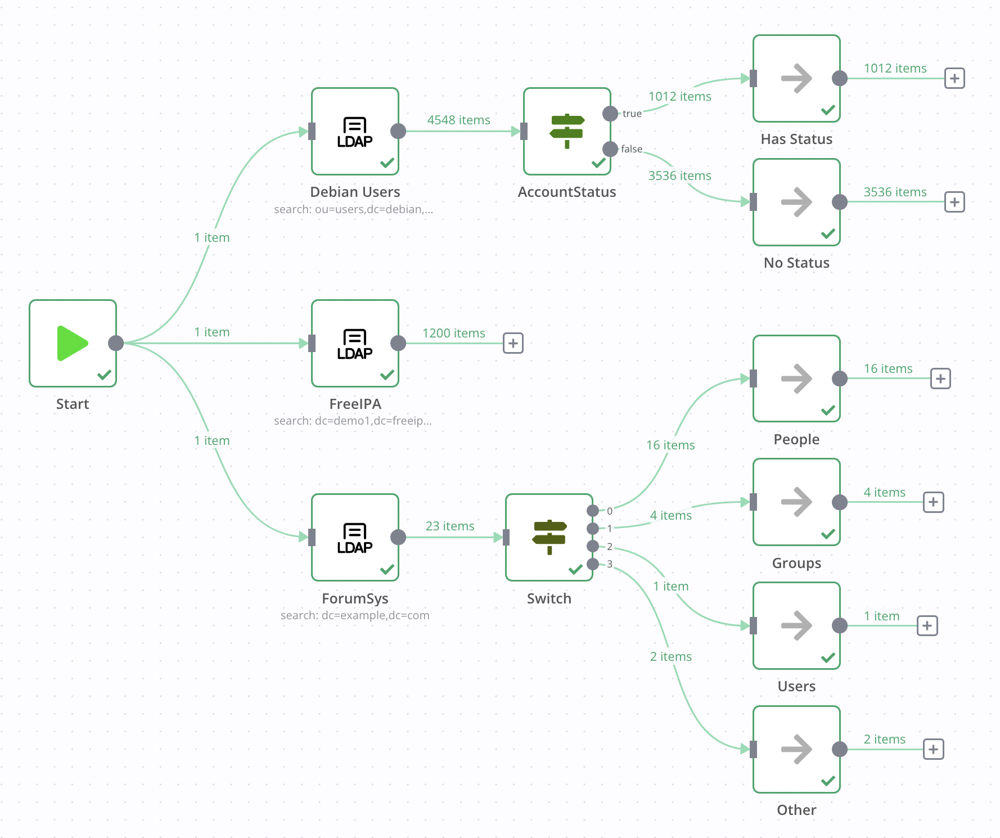

# n8n-nodes-ldap

This is an n8n community node for interacting with LDAP servers including OpenLDAP and Active Directory.


[n8n](https://n8n.io/) is a [fair-code licensed](https://docs.n8n.io/reference/license/) workflow automation platform.

- [Installation](#installation)
  - [Community Nodes (Recommended)](#community-nodes-recommended)
  - [Manual installation](#manual-installation)
- [Operations](#operations)
- [Credentials](#credentials)
  - [Credentials Example](#credentials-example)
- [Compatibility](#compatibility)
- [Example Workflow](#example-workflow)
  - [Credentials](#credentials-1)
  - [Workflow](#workflow)
- [Further Testing](#further-testing)
- [Resources](#resources)
- [License](#license)

## Installation

Follow the [installation guide](https://docs.n8n.io/integrations/community-nodes/installation/) in the n8n community nodes documentation.

### Community Nodes (Recommended)

For users on n8n v0.187+, your instance owner can install this node from [Community Nodes](https://docs.n8n.io/integrations/community-nodes/installation/).

1. Go to **Settings > Community Nodes**.
2. Select **Install**.
3. Enter `n8n-nodes-ldap` in **Enter npm package name**.
4. Agree to the [risks](https://docs.n8n.io/integrations/community-nodes/risks/) of using community nodes: select **I understand the risks of installing unverified code from a public source**.
5. Select **Install**.

After installing the node, you can use it like any other node. n8n displays the node in search results in the **Nodes** panel.

### Manual installation

To get started install the package in your n8n root directory:

`npm install n8n-nodes-ldap`

For Docker-based deployments add the following line before the font installation command in your [n8n Dockerfile](https://github.com/n8n-io/n8n/blob/master/docker/images/n8n/Dockerfile):

`RUN cd /usr/local/lib/node_modules/n8n && npm install n8n-nodes-ldap`

## Operations

- **Compare**: Compare an attribute to a value
  - `DN`: The distinguised name of the object to compare
  - `Attribute ID`: The attribute to compare the value against
  - `Value`: The value to compare
- **Create**: Create a new object
  - `DN`: The distinguised name of the object to create
  - **Attributes**
    - `Attribute ID`: The attribute ID to create with the object
    - `Value`: The value of the attribute
- **Delete**: Delete an object
  - `DN`: The distinguised name of the object to delete
- **Modify**: Modify an object
  - `DN`: The distinguised name of the object to modify
  - **Modify Attribute**
    - **Add**: Add a value to an attribute
      - `Attribute ID`: The attribute ID to add a value to
      - `Value`: The value of the attribute to add
    - **Replace**: Replace the value of an attribute
      - `Attribute ID`: The attribute to replace the value of
      - `Value`: The value of the attribute to replace
    - **Remove**: Remove a value from an atrribute
      - `Attribute ID`: The attribute ID to remove from the object
      - `Value`: The value of the attribute remove
- **Rename**: Rename an object
  - `DN`: The distinguised name of the object to rename
  - `Target DN`: The distinguised name to rename the object to
- **Search**: Search the directory
  - `Base DN`: The subtree to search in
  - `Filter` (default: `(objectclass=*)`): LDAP filter
  - `Return All`: Whether to return all results
  - `Limit`: How many results to return
  - **Options**
    - `Attributes`: Comma-separated list of attributes to return
    - `Scope`: The set of entries at or below the BaseDN that may be considered potential matches

## Credentials

You need to create an LDAP credential to use this node. The only required fields are `Hostname` and `SSL/TLS`, if you're using default ports everything should work. By default SSL/TLS will use port `636`, and non-TLS will use port `389`. The full list of supported connection options:

- **Hostname**: The hostname or IP of the LDAP server
- **SSL/TLS**: If the connection should use SSL/TLS
- **Bind DN** (optional): The full bind DN for the authenticating user/object
- **Bind Password** (optional): The associated password for the `Bind DN`
- **Port** (optional): The port to connect to. If not specified, the default port will be used (`389` or `636` for SSL/TLS)
- **Ignore SSL/TLS Issues** (default: `true`): Whether to connect even if SSL/TLS certificate validation is not possible
- **CA Certificate** (optional): A PEM formatted CA certificate use for SSL/TLS certificate validation. Useful for self-signed and internal CAs

### Credentials Example


## Compatibility

n8n v0.187+

## Example Workflow



### Credentials

You'll need three credentials to execute the three LDAP nodes.

#### Debian Users

- **Hostname**: `db.debian.org`
- **SSL/TLS**: `false`

#### FreeIPA

- **Hostname**: `ipa.demo1.freeipa.org`
- **SSL/TLS**: `false`

#### ForumSys

- **Hostname**: `ldap.forumsys.com`
- **SSL/TLS**: `false`
- **Bind DN**: `cn=read-only-admin,dc=example,dc=com`
- **Bind Password**: `password`

### Workflow

<details>
<summary><b>Expand to show workflow JSON</b></summary>

*Copy and paste this JSON into a blank n8n workflow!*

```json
{
  "nodes": [
    {
      "parameters": {},
      "name": "Start",
      "type": "n8n-nodes-base.start",
      "typeVersion": 1,
      "position": [
        240,
        440
      ]
    },
    {
      "parameters": {
        "baseDN": "ou=users,dc=debian,dc=org",
        "returnAll": true,
        "options": {}
      },
      "name": "Debian Users",
      "type": "n8n-nodes-ldap.LDAP",
      "typeVersion": 1,
      "position": [
        560,
        200
      ],
      "credentials": {
        "ldap": {
          "id": "49",
          "name": "db.debian.org LDAP"
        }
      }
    },
    {
      "parameters": {
        "conditions": {
          "string": [
            {
              "value1": "={{$json.accountStatus}}",
              "operation": "isNotEmpty"
            }
          ]
        }
      },
      "name": "AccountStatus",
      "type": "n8n-nodes-base.if",
      "typeVersion": 1,
      "position": [
        800,
        200
      ]
    },
    {
      "parameters": {},
      "name": "Has Status",
      "type": "n8n-nodes-base.noOp",
      "typeVersion": 1,
      "position": [
        1060,
        140
      ]
    },
    {
      "parameters": {},
      "name": "No Status",
      "type": "n8n-nodes-base.noOp",
      "typeVersion": 1,
      "position": [
        1060,
        280
      ]
    },
    {
      "parameters": {
        "dataType": "string",
        "value1": "={{ $json[\"objectClass\"][0] }}",
        "rules": {
          "rules": [
            {
              "value2": "inetOrgPerson"
            },
            {
              "value2": "groupOfUniqueNames",
              "output": 1
            },
            {
              "value2": "simpleSecurityObject",
              "output": 2
            }
          ]
        },
        "fallbackOutput": 3
      },
      "name": "Switch",
      "type": "n8n-nodes-base.switch",
      "typeVersion": 1,
      "position": [
        780,
        660
      ]
    },
    {
      "parameters": {},
      "name": "People",
      "type": "n8n-nodes-base.noOp",
      "typeVersion": 1,
      "position": [
        1060,
        480
      ]
    },
    {
      "parameters": {},
      "name": "Groups",
      "type": "n8n-nodes-base.noOp",
      "typeVersion": 1,
      "position": [
        1060,
        620
      ]
    },
    {
      "parameters": {},
      "name": "Users",
      "type": "n8n-nodes-base.noOp",
      "typeVersion": 1,
      "position": [
        1060,
        760
      ]
    },
    {
      "parameters": {},
      "name": "Other",
      "type": "n8n-nodes-base.noOp",
      "typeVersion": 1,
      "position": [
        1060,
        900
      ]
    },
    {
      "parameters": {
        "baseDN": "dc=example,dc=com",
        "returnAll": true,
        "options": {}
      },
      "name": "ForumSys",
      "type": "n8n-nodes-ldap.LDAP",
      "typeVersion": 1,
      "position": [
        560,
        660
      ],
      "credentials": {
        "ldap": {
          "id": "50",
          "name": "ldap.forumsys.com LDAP"
        }
      }
    },
    {
      "parameters": {
        "baseDN": "dc=demo1,dc=freeipa,dc=org",
        "limit": 1200,
        "options": {}
      },
      "name": "FreeIPA",
      "type": "n8n-nodes-ldap.LDAP",
      "typeVersion": 1,
      "position": [
        560,
        440
      ],
      "credentials": {
        "ldap": {
          "id": "55",
          "name": "LDAP account"
        }
      }
    }
  ],
  "connections": {
    "Start": {
      "main": [
        [
          {
            "node": "Debian Users",
            "type": "main",
            "index": 0
          },
          {
            "node": "ForumSys",
            "type": "main",
            "index": 0
          },
          {
            "node": "FreeIPA",
            "type": "main",
            "index": 0
          }
        ]
      ]
    },
    "Debian Users": {
      "main": [
        [
          {
            "node": "AccountStatus",
            "type": "main",
            "index": 0
          }
        ]
      ]
    },
    "AccountStatus": {
      "main": [
        [
          {
            "node": "Has Status",
            "type": "main",
            "index": 0
          }
        ],
        [
          {
            "node": "No Status",
            "type": "main",
            "index": 0
          }
        ]
      ]
    },
    "Switch": {
      "main": [
        [
          {
            "node": "People",
            "type": "main",
            "index": 0
          }
        ],
        [
          {
            "node": "Groups",
            "type": "main",
            "index": 0
          }
        ],
        [
          {
            "node": "Users",
            "type": "main",
            "index": 0
          }
        ],
        [
          {
            "node": "Other",
            "type": "main",
            "index": 0
          }
        ]
      ]
    },
    "ForumSys": {
      "main": [
        [
          {
            "node": "Switch",
            "type": "main",
            "index": 0
          }
        ]
      ]
    }
  }
}
```

</details>

## Further Testing

If you want to test binding to a server and mutating objects, you can stand up your own OpenLDAP instance to test:

```shell
docker run --rm --name openldap -p 1389:1389 \
  --env LDAP_ADMIN_USERNAME=admin \
  --env LDAP_ADMIN_PASSWORD=adminpassword \
  --env LDAP_USERS=customuser,user01,user02 \
  --env LDAP_PASSWORDS=custompassword,password1,password2 \
  bitnami/openldap:latest
```

Then configure your n8n LDAP credentials:

- **Hostname**: `localhost`
- **SSL/TLS**: `false`
- **Bind DN**: `cn=admin,dc=example,dc=org`
- **Bind Password**: `adminpassword`
- **Port**: `1389`

## Resources

- [n8n community nodes documentation](https://docs.n8n.io/integrations/community-nodes/)

## License

[MIT](https://github.com/pemontto/n8n-nodes-ldap/blob/master/LICENSE.md)
